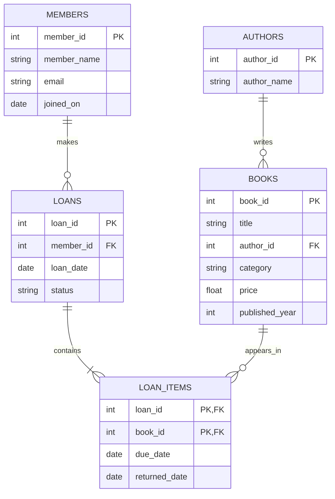

# ER diagram (Mermaid)

```mermaid
erDiagram
  AUTHORS ||--o{ BOOKS : writes
  MEMBERS ||--o{ LOANS : makes
  LOANS ||--|{ LOAN_ITEMS : contains
  BOOKS ||--o{ LOAN_ITEMS : appears_in
  AUTHORS { int author_id PK string author_name }
  MEMBERS { int member_id PK string member_name string email date joined_on }
  BOOKS { int book_id PK string title int author_id FK string category float price int published_year }
  LOANS { int loan_id PK int member_id FK date loan_date string status }
  LOAN_ITEMS { int loan_id PK,FK int book_id PK,FK date due_date date returned_date }
```
